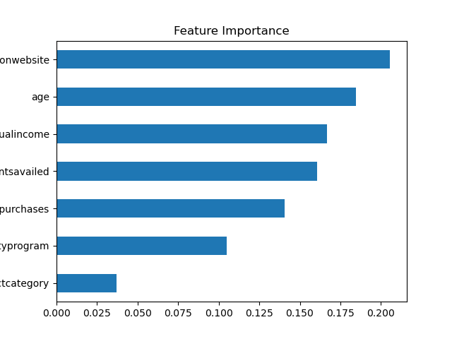
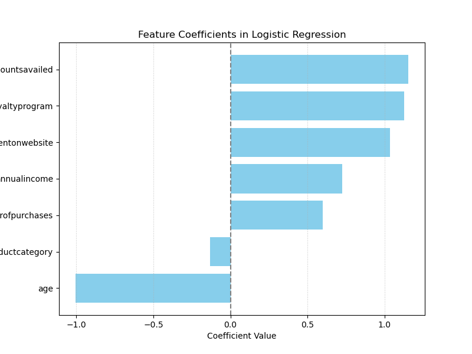
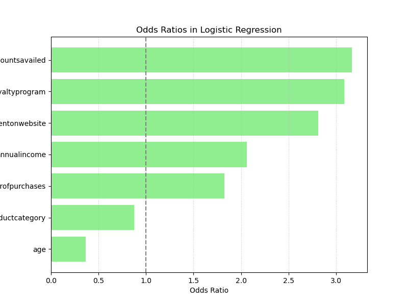
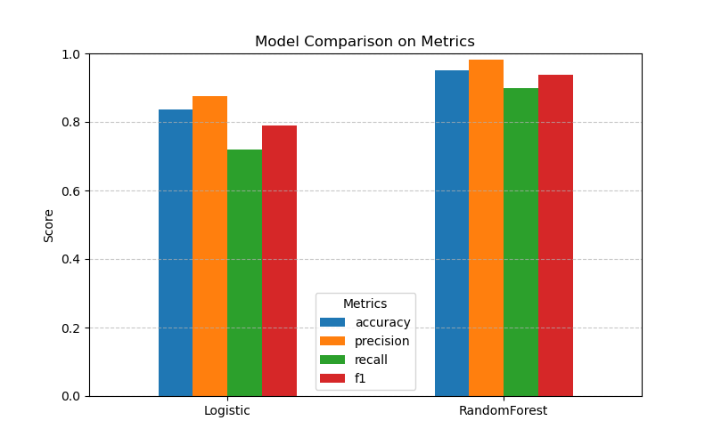

--Customer Purchase Prediction Project--

-- 專案簡介

本專案運用 Logistic Regression 與 Random Forest 模型，預測顧客購買行為，分析關鍵影響因子，協助公司制定更精準的行銷與會員經營策略。

⸻

-- 專案背景與目標

隨著線上顧客資料日益豐富，企業希望能掌握：
	•	哪些顧客特徵會提高購買機率
	•	會員計畫是否帶來顯著轉換提升
	•	哪些族群值得投入更多行銷資源

透過此分析，能幫助行銷團隊精準投放、優化 UX 及提升整體營收。

⸻
-- 資料檔案
	•	data/raw/customer_purchase_data.csv：原始交易與瀏覽資料
	•	data/processed/grouped_summary.csv：資料清理與群組彙總後檔案

-- 主要欄位
| 欄位              | 說明                             |
|-------------------|---------------------------------|
| Age               | 顧客年齡                          |
| Gender            | 性別 (0/1)                       |
| AnnualIncome      | 年收入                           |
| NumberOfPurchases | 歷史購買次數                      |
| ProductCategory   | 購買產品類別                      |
| TimeSpentOnWebsite| 本次網站停留時間（秒）              |
| LoyaltyProgram    | 是否為會員（0/1）                  | 
| DiscountsAvailed  | 曾使用的折扣次數                   |
| PurchaseStatus    | 是否完成購買（0/1），**目標變數**     |

-- 使用技術與分析流程
  • Python：pandas, sklearn, matplotlib
	•	模型：Logistic Regression, Random Forest
	•	圖表輸出：- Feature Importance (Random Forest),Odds Ratios (Logistic Regression),Feature Coefficients (Logistic Regression),Model Comparison (Accuracy / Recall / Precision)
	•	特徵係數 (Logistic Coefficients)
	•	Odds Ratio
	•	特徵重要性 (Feature Importance)
	•	模型比較報表
  • 使用 StandardScaler 做數據標準化
  • Hyperparameter tuning (n_estimators=100, max_depth=5)
  
 -- 流程圖
 
 Data Ingestion -> Data Cleaning -> EDA -> Modeling -> Evaluation -> Business Insights
 
 --  專案架構


## 專案架構

```plaintext
customer-purchase-prediction/
├── data/
│   ├── raw/
│   │   └── customer_purchase_data.csv
│   └── processed/
│       └── grouped_summary.csv
├── notebooks/
│   └── Customer Purchase Behavior Dataset.ipynb
├── outputs/
│   ├── feature_coefficients_logistic.png
│   ├── feature_importance.png
│   ├── odds_ratios_logistic.png
│   ├── model_comparison.png
│   └── model_compare_metrics.csv
├── README.md
└── .gitignore
```
-- 模型輸出與圖片洞察

-- 圖片洞察

Feature Importance (Random Forest)
顯示哪些特徵對預測顧客購買最重要。


Feature Coefficients (Logistic Regression)
用邏輯回歸看係數，顯示每個變數影響購買機率的方向與強度。


Odds Ratios (Logistic Regression)
用邏輯回歸的 Odds Ratio 觀察每個變數對購買機率的提升或抑制。


模型比較
比較不同模型的準確率、召回率與精確率。


| 模型                | Accuracy | Recall | Precision |
|---------------------|----------|--------|-----------|
| Logistic Regression |   0.78   |  0.72  |    0.75   |
| Random Forest       |   0.83   |  0.79  |    0.80   |

-- 專案之價值

1. 辨識 高價值顧客族群（如年齡較高、網站停留時間長、會員身份）以更有效率投放資源
2. 驗證 網站停留時間 對購買的顯著影響，提供 UX 團隊優化方向
3. 提供 會員計畫的量化成效，作為擴展會員策略依據
4. 建立資料驅動的 轉換率優化基礎模型，能快速調整行銷活動與預算

-- 關鍵洞見
	•	Age：年齡越大，購買機率顯著提升
	•	Time on website：停留時間較長者，轉換機率提高超過 2.5 倍
	•	Number of previous purchases：回購率高，顯示強烈的顧客忠誠度
	•	Loyalty program：會員的購買機率為非會員的 3 倍，證實會員計畫成效
  • 建議針對年齡較高與網站停留時間長的顧客，推出專屬優惠券與會員積分活動，提升短期轉換率，同時穩定長期忠誠度
  • 提供清楚的會員 ROI 證據，幫助決策層決定是否擴大會員活動
  • 建議針對高回購群推跨售活動
  • 利用特徵重要性決定 UI 頁面資訊強化哪些欄位
⸻

-- 未來優化方向
	•	加入更多特徵如裝置類型、地區、點擊熱圖分析
	•	與 A/B 測試結合，進一步驗證不同行銷活動對購買率的影響
	•	導入預測性分群，優化行銷預算配置
  • 加入行為序列 (session clickstream)
  • 嘗試 XGBoost 與調參提升 recall
  • 整合網站熱點分析，優化 UX layout
  • 尚未進行 Cross Validation（可列為後續優化項目）

-- 資料來源 https://www.kaggle.com/datasets/rabieelkharoua/predict-customer-purchase-behavior-dataset
-- 所有生成的圖表皆已保存在 `outputs/` 資料夾，並在此 README 中直接嵌入以利快速檢視。
⸻⸻⸻⸻⸻⸻⸻⸻⸻⸻⸻⸻⸻⸻⸻


# Customer Purchase Prediction Project

This project analyzes customer purchase data using logistic regression and random forest models.  
It explores key factors influencing purchase behavior and provides actionable insights.

---

## What did this help the company with?
- Identified **high-value customer segments** (e.g. older, loyal, longer site visitors) to target marketing more precisely.
- Showed that **time spent on the website** is a major conversion driver, suggesting UI/UX investments pay off.
- Quantified the impact of **loyalty programs**, providing evidence for scaling membership campaigns.
- Supported data-driven **campaign optimization** — focus resources where conversion probability is highest.

---

## Key Insights
- **Age**: Older customers are significantly more likely to make purchases.
- **Time on website**: Longer browsing sessions dramatically increase purchase likelihood.
- **Number of previous purchases**: Past buyers keep buying — retention pays.
- **Loyalty program**: Being a member strongly boosts odds of purchase.

---

##  Skills & tools I used
- **Python (pandas, scikit-learn, matplotlib)** for data wrangling, modeling, and visualization.
- **Logistic regression & random forest** for classification & feature importance.
- **Statistical interpretation** of odds ratios to turn numbers into clear business recommendations.
- **Version control with Git & GitHub** to structure and track the project.
- **Markdown & README writing** to communicate findings to both technical & non-technical teams.

##  Outputs
- Feature importance plots & odds ratios to visualize top drivers of purchase behavior.
- A summary CSV of grouped data for quick reference.
- Jupyter Notebook capturing the entire exploratory & modeling process.


## Conclusion
By targeting older, loyal customers who spend more time browsing — and doubling down on loyalty programs —  
the company can **optimize marketing ROI and boost sales conversion**.  
This project shows how data analysis directly supports smarter business strategy. 

## Dataset Source
[Customer Purchase Behavior Dataset on Kaggle](https://www.kaggle.com/datasets/rabieelkharoua/predict-customer-purchase-behavior-dataset)
---
